# bot typescript Despliegue
### Equipo:

Magariños Chavez Gaston(Messi)

Ferrer Quaglia Agustin(L.Martinez),

Delfini Tiago(Paredes)

Robaina Ignacio (Gago)

Bisignani Gino (Molina)

---

Para el bot utilizamos el mismo entorno que se creo de ejemplo en la materia.

en la carpeta 'src' se encuentra el codigo del bot en el archivo 'strategy.ts'.

# Inicializacion del bot

```bash
npm run dev
```

# Creacion y explicacion de la estrategia
La estrategia esta creada a partir de varias funciones que son utilizadas en conjunto en la funcion chooseMove()

## Explicamos un poco cada funcion por separado
#### Funcion findPieces
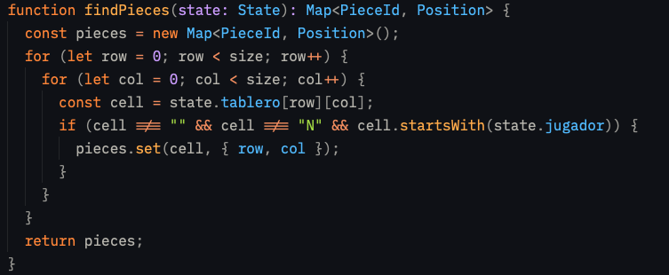

Esta funcion la utilizamos para encontrar las piezas que vamos a utilizar en el tablero.
espera un argumento del tipo State y devuelve un Map con la pieza del tipo PieceId y su posicion en el tablero del tipo Position.

#### Funcion findEnemy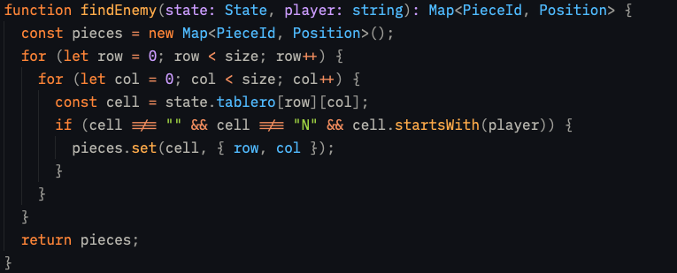

Esta funcion la utilizamos para encontrar las piezas enemigas en el tablero.
hace lo mismo que la funcion findPieces, espera un argumento del tipo State y devuelve un Map con la pieza del tipo PieceId y su posicion en el tablero del tipo Position.

#### Funcion findHouses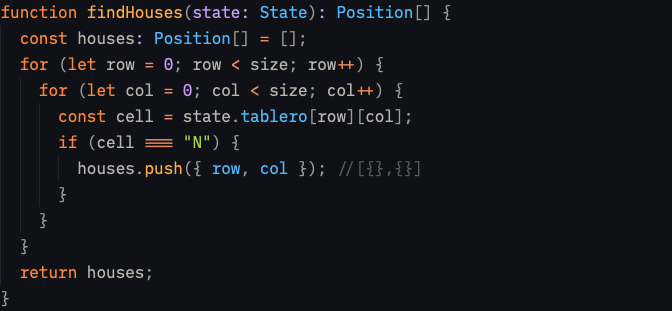

Esta funcion la utilizamos para encontrar las casas en el tablero.
espera un argumento del tipo State y devuelve un array con la posicion en el tablero del tipo Position.

#### Funcion samePosition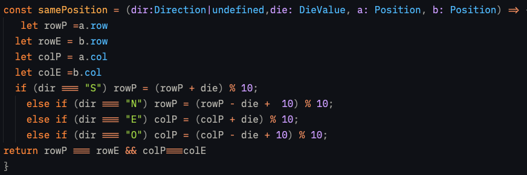

Esta funcion la utilizamos para comparar dos posiciones en el tablero puede ser de ambas piezas aliadas o la de una pieza aliada y una pieza enemiga. En base a la direccion del movimiento, resta/suma la fila o columna y luego compara, devuelve un booleano.Si una pieza aliada o enemiga estan en la posicion que se tiene que mover la pieza indicada devuelve true, si no false.

#### Funcion toroidal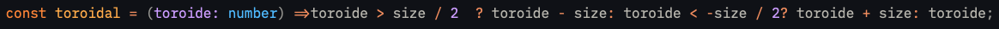

Esta funcion la utilizamos para comprobar si una posicion esta dentro de los limites del tablero. las utiliza la funcion distance y la funcion direction.

#### Funcion distance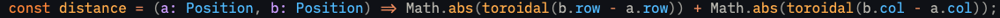

Esta funcion la utilizamos para calcular la distancia entre dos posiciones en el tablero. Utilizamos la formula de distancia manhattan.

#### Funcion direction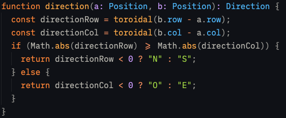

Esta funcion la utilizamos para calcular la direccion entre dos posiciones en el tablero.Si las filas son mayores o iguales a la columna se va a mover hacia arriba o hacia abajo,dependiendo de la directionRow si el valor es negativo o positivo. Si las columnas son mayores a las filas se va a mover hacia la izquierda o hacia la derecha, dependiendo de la directionCol si el valor es negativo o positivo.Devuelve una direccion en forma de string.

# Explicacion de la funcion principal que devuelve el movimiento al arbitro

#### Variables declaradas en la funcion

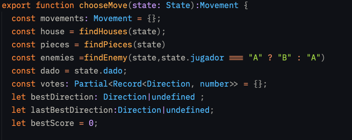

estas variables las utilizamos con tipos para que las variables obtengan el valor correcto y evitar errores.

movements = es la variable la cual vamos a retornar al arbitro, es del tipo Movement y devuelve la pieza y la direccion en la que se va a mover las piezas en un objeto.

house,pieces,enemies = son variables que almacenan la informacion del tablero, las piezas y los enemigos respectivamente.

dado = es la variable que almacena el dado que envia el arbitro.

votes = la utilizamos para guardar en un objeto, segun la direccion un numero que nos va a permitir reutilizar para encontrar la mejor direccion posible.Utilizamos utility types como parcial para que no nos pida las direcciones antes de cargar los numeros y record para utilizar un set de propiedades

bestDirection,lastBestDirection = bestDirection guarda la mejor direccion y lastBestDirection guarda la anterior mejor direccion.

bestScore = la utilizamos para guardar el mejor puntaje obtenido en una direccion.

####  1ra Parte del Algoritmo (encontrar la mejor direccion)

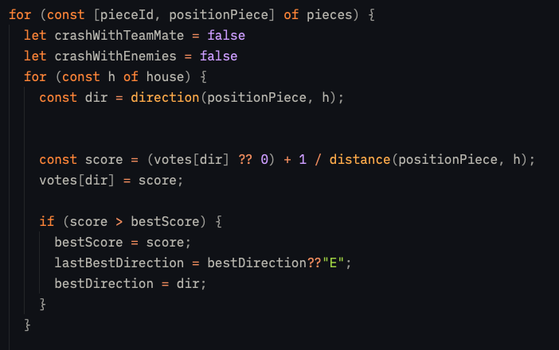

Son dos bucles for of anidados, el primero recorre las piezas y el segundo recorre las direcciones, calculando el puntaje de cada direccion y guardando la mejor direccion encontrada.Las variables booleanas son utilizadas en la segunda parte del algoritmo que se encuentra dentro del for of de las piezas.

El bucle for of de las casas lo que hace es iterar sobre las casas y dentro de esta se encuentra

dir = en dir vamos a llamar a la funcion direction con los argumentos de la pocision de la pieza y la posicion de la casa.

score = segun la dir vamos a hacer una operacion con el valor de esa direccion que esta guardado en votes y lo vamos a guardar en score.si el valor de votes[dir] es undefined se le va a signar ?? el valor 0.

votes[dir] = guarda el valor de score en la clave dir que este en ese momento iterando.

despues tenemos un condicional en el cual si score es mayor que bestScore entonces bestScore = score ,lastBestDirection = bestDirection o ?? "E" si no hay todavia una bestDirectionDirection y bestDirection = dir.
####  2da Parte del Algoritmo (que las piezas no se pisen,sean aliadas o enemigas)

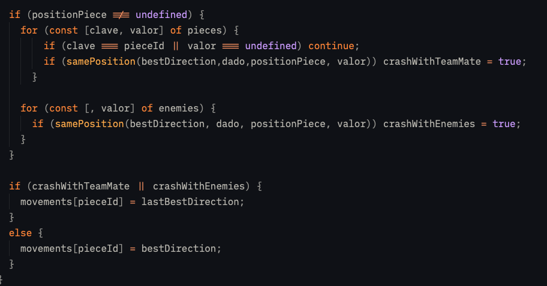
Este algoritmo esta compuesto de un condicional, con dos bucles, uno utilizado para comparar las coordenadas de piezas aliadas con la pieza seleccionada y la otra para compararlas con las piezas enemigas
al condicional se entra si la posicion de la pieza que se esta iterando en el bucle no es undefined.

en el primer bucle se compara primero si clave es igual a pieceId o si el valor es undefined va utilizar continue, en el segundo comparador del bucle compara la posicion de la pieza aliada con la posicion de la pieza seleccionada y en el segundo bucle se compara la posicion de la pieza enemiga con la posicion de la pieza seleccionada utilizando la funcion samePosition que devuelve true si las posiciones son iguales.

Fuera de este condicional con los bucles, tenemos otro condicional el cual si cualquiera de las variables que vimos al principio del for of principal es true va a guardar en la variable movements[pieceId] = lastBestDirection y sino va a guardar en la variable movements[pieceId] = bestDirection

# Observacion de la version 1.0.0 del bot

Si bien hemos podido armar un algoritmo que nos indica el mejor movimiento en base a un scoring y tambien poder hacer que las piezas no se pisen, sean aliadas o enemigas, tenemos unos bugs a resolver para la version 2.0.0 el primero es el hecho de que la primera pieza siempre que se pise con otra pieza, se mueve a un movimiento predeterminado que es "E" el problema de esto viene que cuando se mueve a esa direccion, puede haber una pieza en esa direccion o incluso capaz la pieza tenia esa direccion y como hay una pieza que va a pisar por ese valor inicial "E" termina eligiendo la misma direccion que ya tenia asignada. y el segundo es cuando queda una ultima casa entonces puede darse el evento de tener 2 piezas de diferntes posiciones que caen en la ultima cas y por el hecho de que no hay otra direccion disponible siguen haciendo movimientos invalidos hasta perder.

## Simulacion
Armamos un simulador de jugadas dentro de la app del arbitro en la cual nos permite simular jugadas en cantidad y ver como se comporta el bot en las simulaciones

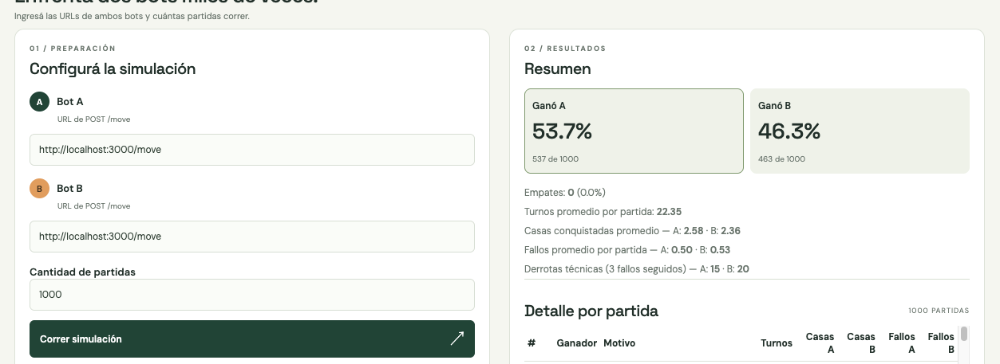

en este caso ponemos a jugar el mismo bot de los dos lados y las metricas dentro de todo son positivas,teniendo un porcentaje de derrotas tecnicas del 1 al 2% en una simulacion de 1000 partidas por bot.

## Testeo Manual

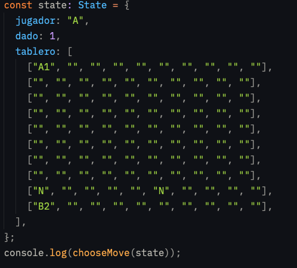

#### Terminal

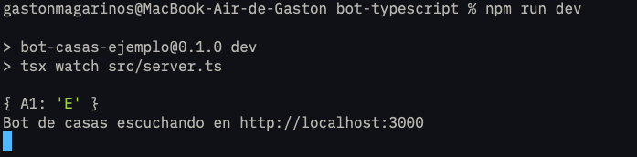


Creamos un testeo manual para ir probando las jugadas y como se comportaba las piezas si se encontraban en la situacion de pisarse, ahora con lo que vimos en la ultima clase sobre los testeos podremos ir probando las jugadas y ver como se comporta el bot en situaciones reales.Disponibles en la version 2.0
